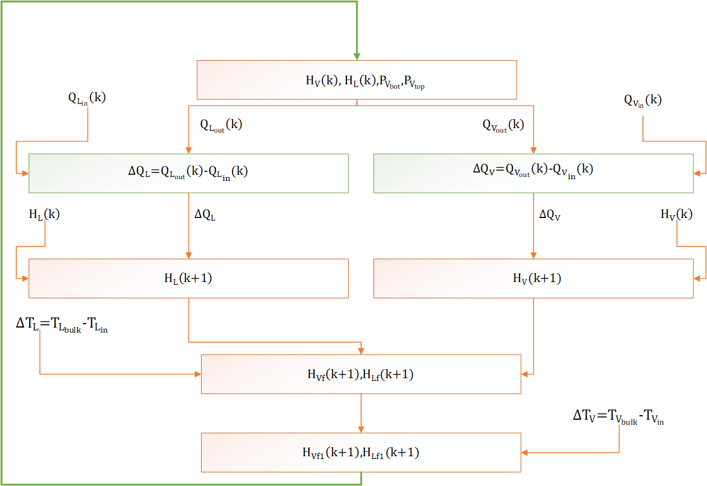
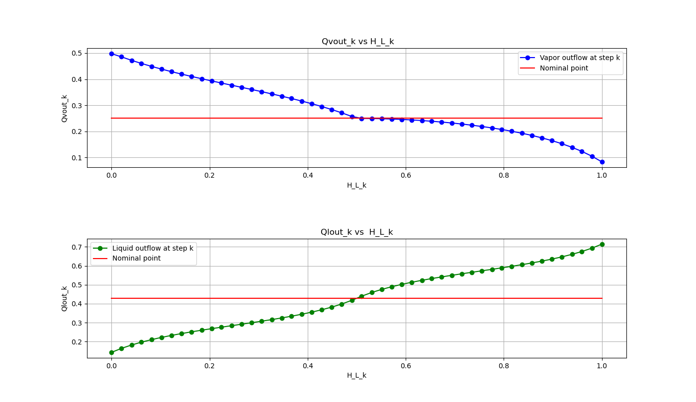
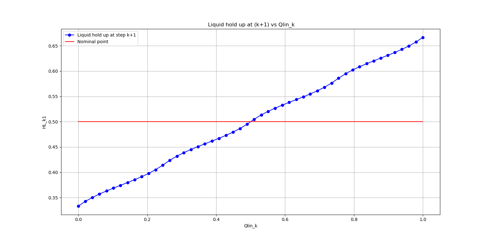
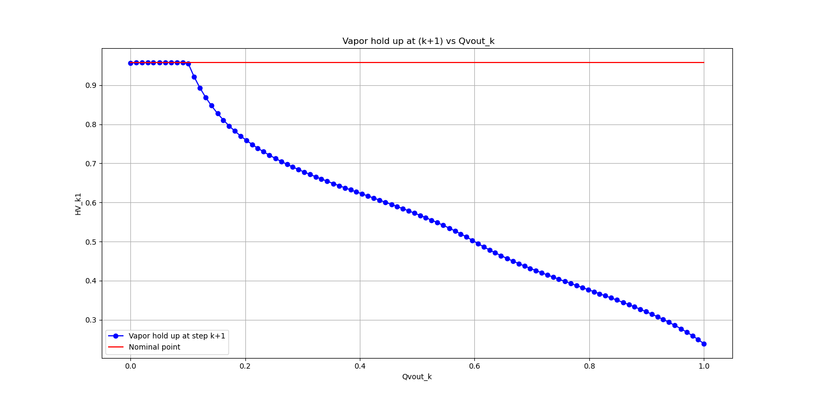
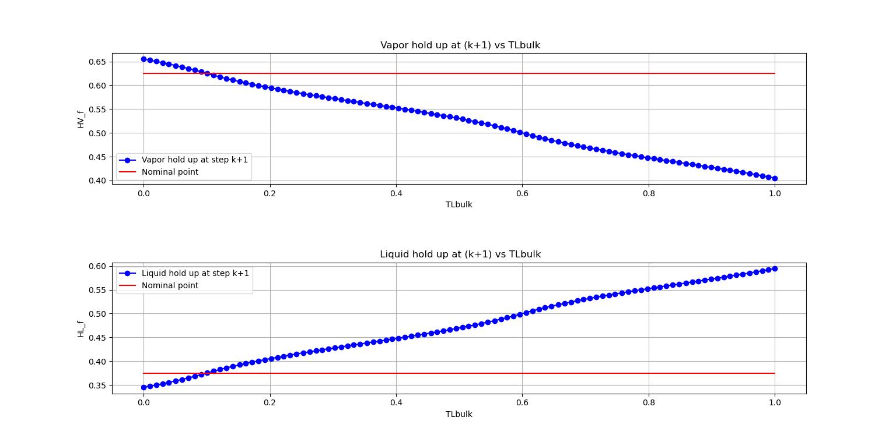
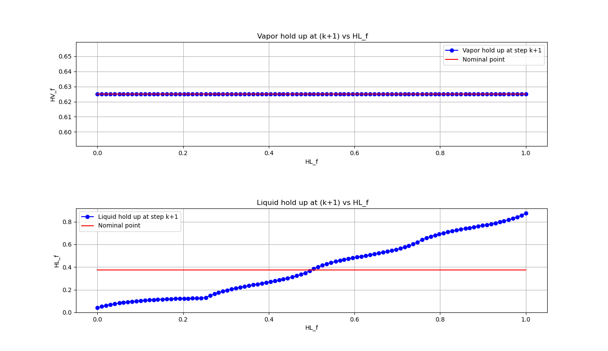
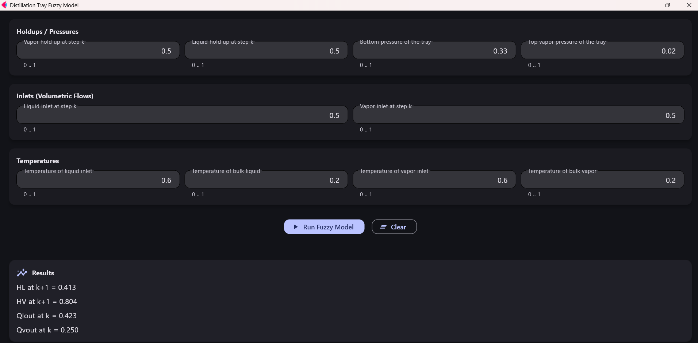

# Fuzzy Modeling of Distillation-Tray Hydraulics

A **knowledge-based dynamic model of distillation-tray hydraulics** developed using cascaded Mamdani fuzzy inference systems.

The project represents qualitative engineering knowledge about liquid and vapor behavior on a distillation tray using fuzzy membership functions, explicit engineering rules, and interconnected inference blocks.

It was developed as part of the **Artificial Intelligence Applications in Chemical Engineering** course at Sharif University of Technology.

---

## Overview

Distillation-tray hydraulics involve coupled interactions between liquid and vapor flows, phase holdups, pressure conditions, and temperature differences.

Representing all of these effects inside one large fuzzy inference system would create a very large rule base. The model was therefore decomposed into **five interconnected fuzzy subsystems (A–E)**, allowing individual physical relationships to be modeled with smaller and more interpretable rule sets.



The complete model propagates information through the five subsystems and returns updated liquid and vapor holdups for the next simulation step.

---

## Model Architecture

### Block A — Outlet Flow Estimation

Block A estimates the current liquid and vapor outlet flow rates using:

- liquid holdup \(H_L(k)\)
- vapor holdup \(H_V(k)\)
- vapor pressure below the tray \(P_{V,bot}\)
- vapor pressure above the tray \(P_{V,top}\)

The outputs are:

\[
Q_{L,out}(k)
\]

and

\[
Q_{V,out}(k)
\]

The fuzzy rule base represents the qualitative influence of tray holdup and pressure conditions on liquid and vapor discharge.

---

### Block B — Liquid Holdup Dynamics

The liquid-flow imbalance is calculated from the inlet and outlet liquid flows:

\[
\Delta Q_L =
Q_{L,in}(k)-Q_{L,out}(k)
\]

Block B combines this flow imbalance with the current liquid holdup to estimate:

\[
H_L(k+1)
\]

---

### Block C — Vapor Holdup Dynamics

Similarly, the vapor-flow imbalance is calculated as:

\[
\Delta Q_V =
Q_{V,in}(k)-Q_{V,out}(k)
\]

Block C combines this quantity with the current vapor holdup to estimate:

\[
H_V(k+1)
\]

---

### Block D — Liquid-Temperature Effect

The liquid-temperature difference is defined as:

\[
\Delta T_L =
T_{L,bulk}-T_{L,in}
\]

Block D uses this temperature difference together with the intermediate liquid and vapor holdups to account for the influence of liquid-temperature conditions on the tray state.

Its outputs are corrected liquid and vapor holdups.

---

### Block E — Vapor-Temperature Effect

The vapor-temperature difference is defined as:

\[
\Delta T_V =
T_{V,bulk}-T_{V,in}
\]

Block E applies the final temperature-related correction and produces the final estimates of liquid and vapor holdup for the next time step.

These values can then be fed back into Block A to continue the dynamic simulation.

---

## Fuzzy Inference Framework

The model is based on **Mamdani fuzzy inference**.

The implementation supports:

- triangular membership functions
- Gaussian membership functions
- multiple T-norm formulations
- multiple S-norm formulations
- different defuzzification methods
- rule bases stored externally in CSV files
- cascaded execution of several fuzzy inference systems

The current graphical implementation uses:

- **Triangular membership functions**
- **Minimum T-norm**
- **Maximum S-norm**
- **Centroid defuzzification**

The Python implementation uses `scikit-fuzzy` to construct antecedents, consequents, fuzzy membership functions, and inference rules. The rule bases are read from external CSV files rather than being hard-coded directly into the program.

---

## Knowledge-Based Modeling

A central objective of this project is to translate qualitative engineering knowledge into an executable computational model.

Instead of requiring an explicit analytical equation for every interaction in tray hydraulics, engineering concepts such as:

- Low
- Medium
- High
- Very High
- Positive
- Negative
- Zero

are represented through fuzzy sets and connected using IF–THEN engineering rules.

This provides a computational representation of process knowledge when exact quantitative relationships are difficult to formulate.

The separation of the **knowledge base** from the inference code also makes the rule structure easier to inspect and modify.

---

# Sensitivity Analysis

Sensitivity analyses were performed for representative variables in each of the five fuzzy subsystems.

For each analysis, one input is varied while the remaining model inputs are maintained at their nominal operating conditions.

The red line in each figure represents the corresponding nominal output.

These analyses were used to examine the qualitative response of the fuzzy model and check whether the predicted trends were consistent with the intended engineering behavior.

---

## Block A — Sensitivity to Liquid Holdup

The current liquid holdup \(H_L(k)\) is varied to study its effect on the liquid and vapor outlet flow rates.



The analysis shows the coupled influence of tray liquid holdup on:

\[
Q_{L,out}(k)
\]

and

\[
Q_{V,out}(k)
\]

The fuzzy rule base produces different trends for the two outlet flows as the liquid holdup changes.

---

## Block B — Sensitivity to Liquid Inlet Flow

The liquid inlet flow \(Q_{L,in}(k)\) is varied to evaluate its influence on the liquid holdup predicted for the next simulation step.



This evaluates the relationship:

\[
Q_{L,in}(k)
\rightarrow
H_L(k+1)
\]

and illustrates how increasing liquid inflow influences accumulation on the tray.

---

## Block C — Sensitivity to Vapor Outlet Flow

The vapor outlet flow \(Q_{V,out}(k)\) is varied to study its effect on the next-step vapor holdup.



The corresponding relationship is:

\[
Q_{V,out}(k)
\rightarrow
H_V(k+1)
\]

This analysis illustrates how the fuzzy subsystem responds to changes in vapor removal from the tray.

---

## Block D — Sensitivity to Bulk Liquid Temperature

The bulk liquid temperature \(T_{L,bulk}\) is varied while the remaining variables are maintained at their nominal values.



Both liquid and vapor holdups are examined because Block D modifies the intermediate tray state according to the liquid-temperature difference:

\[
\Delta T_L =
T_{L,bulk}-T_{L,in}
\]

The figure illustrates the opposing responses of the predicted liquid and vapor holdups to changing bulk liquid temperature.

---

## Block E — Sensitivity to Intermediate Liquid Holdup

The intermediate liquid holdup \(H_{L,f}\) is varied to study its influence on the final outputs of the cascade.



This analysis examines the final-stage relationship between the intermediate tray state and the liquid and vapor holdups produced after the vapor-temperature correction.

---

# Graphical User Interface

An interactive GUI was developed using **Flet** to make the fuzzy model easier to evaluate.



The interface allows the user to specify normalized values for:

- vapor holdup
- liquid holdup
- bottom tray pressure
- top tray pressure
- liquid inlet flow
- vapor inlet flow
- liquid inlet temperature
- bulk liquid temperature
- vapor inlet temperature
- bulk vapor temperature

The five fuzzy subsystems are then evaluated sequentially.

The GUI reports:

\[
H_L(k+1)
\]

\[
H_V(k+1)
\]

\[
Q_{L,out}(k)
\]

\[
Q_{V,out}(k)
\]

The interface also includes:

- input validation
- progress indication
- light/dark theme switching
- asynchronous execution of the fuzzy blocks
- error handling

---

## Implementation

The fuzzy model is divided into five Python modules corresponding to the five inference blocks.

### Block A

Estimates the liquid and vapor outlet flows.

### Block B

Updates liquid holdup using the liquid-flow imbalance.

### Block C

Updates vapor holdup using the vapor-flow imbalance.

### Block D

Introduces the influence of liquid-temperature differences.

### Block E

Introduces the influence of vapor-temperature differences and produces the final next-step holdups.

The fuzzy rules are maintained in external CSV files, allowing the knowledge base to be modified independently from the Python implementation.

---

## Project Structure

```text
fuzzy-distillation-tray-hydraulics/
│
├── README.md
├── requirements.txt
│
├── Distillation_Tray_Fuzzy_Model_GUI.py
│
├── BlockA_Func.py
├── BlockB_Func.py
├── BlockC_Func.py
├── BlockD_Func.py
├── BlockE_Func.py
│
├── Rules_of_BlockA.csv
├── Rules_deltaQ_BlockB.csv
├── Rules_deltaQ_BlockC.csv
├── Rules_of_BlockD.csv
├── Rules_of_BlockE.csv
│
└── figures/
    ├── fuzzy_model_architecture.png
    ├── gui_screenshot.png
    ├── sensitivity_blockA_HLk.png
    ├── sensitivity_blockB_QLin.png
    ├── sensitivity_blockC_QVout.png
    ├── sensitivity_blockD_TLbulk.png
    └── sensitivity_blockE_HLf.png
```

> The exact names of some rule files may differ depending on the repository version.

---

## Installation

Install the required Python packages:

```bash
pip install -r requirements.txt
```

A minimal `requirements.txt` is:

```text
numpy
pandas
scikit-fuzzy
flet
```

---

## Running the Application

Run:

```bash
python Distillation_Tray_Fuzzy_Model_GUI.py
```

The Flet application will open the graphical interface for the fuzzy model.

---

## Methods and Technologies

- Python
- NumPy
- pandas
- scikit-fuzzy
- Flet
- Mamdani fuzzy inference
- Fuzzy membership functions
- Rule-based knowledge representation
- Sensitivity analysis
- Dynamic process modeling
- Distillation-tray hydraulics
- Knowledge-based engineering

---

## Project Highlights

This project demonstrates:

- decomposition of a high-dimensional fuzzy problem into cascaded subsystems
- representation of chemical-engineering knowledge through linguistic rules
- separation of the rule base from the computational implementation
- dynamic propagation of tray holdups through successive time steps
- sensitivity analysis of individual fuzzy subsystems
- development of an interactive graphical interface for process-model evaluation

---

## Authors

**Mohammad Mahdi Saeedi**  

Sharif University of Technology  
Department of Chemical and Petroleum Engineering
